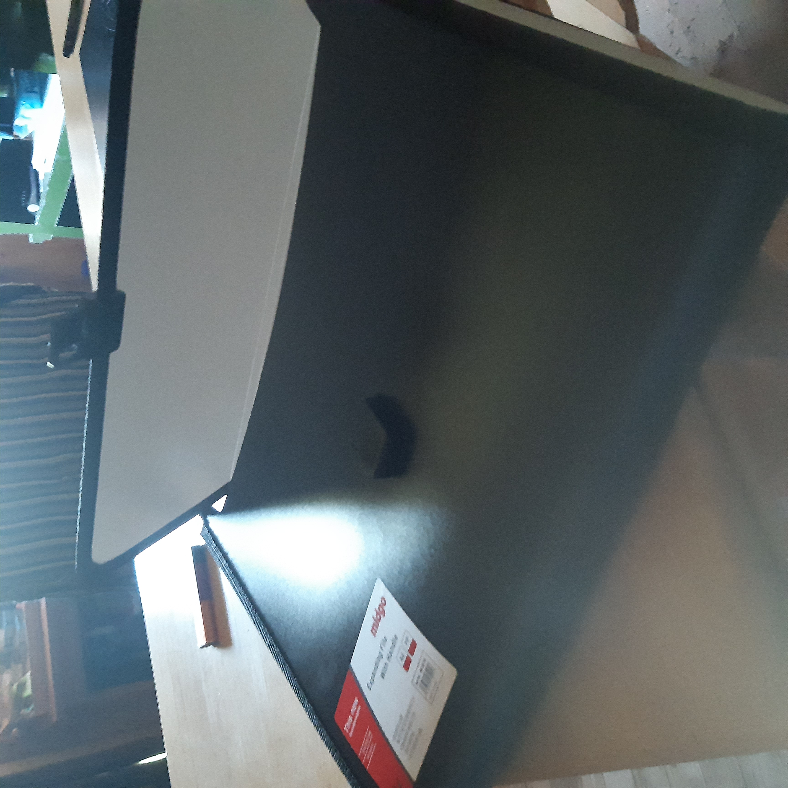

3:51PM

Good day. Today I woke up at 10am and soon went to the store with mom, and we're back just recently. It was quite a trip, we made 9 stops.

First we stopped to check mom's apartament. It looks a bit messy but can be tidied up in a day or two probably. I'm considering trying out to live there for a bit, just to see what it's like. We also got some transparent sticky paper to lay on stickers so they don't wear out.

Then we went to a book store and bought a multi-compartment folder for me(pic below), some sticker paper for both of us, a notebook for me because I want to keep my diary there (lol), and some thin colored cardboard paper for mom's cards (for the earrings)

 

In around a week there will be a fair and I'll probably go to sell my prints and mom's earrings.